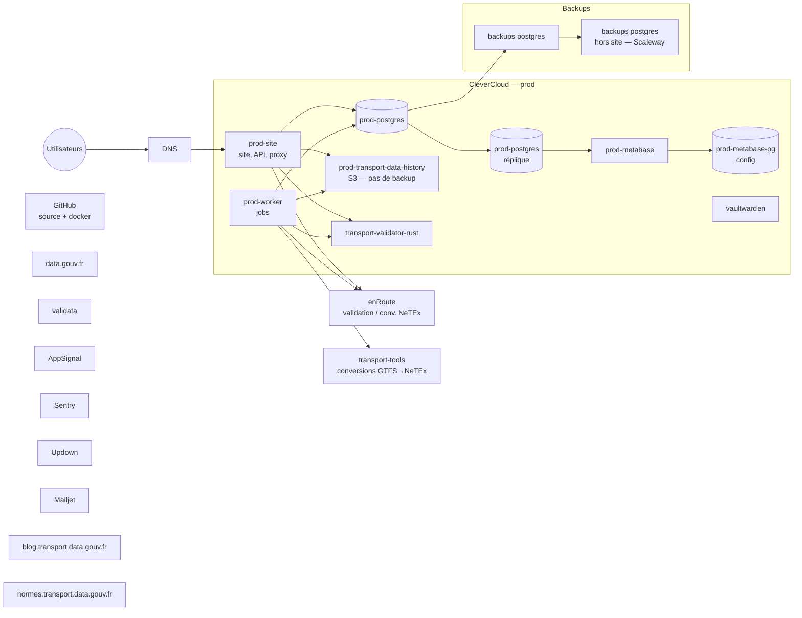

# Architecture d'infrastructure (production)

Vue d'ensemble de la topologie de production : applications hébergées sur
CleverCloud, bases de données, backups et services externes.

Ce document remplace l'ancien schéma Google Drawing, afin que le diagramme soit
versionné et maintenu directement dans le repo. Il est rendu nativement par
GitHub via le bloc Mermaid ci-dessous.

